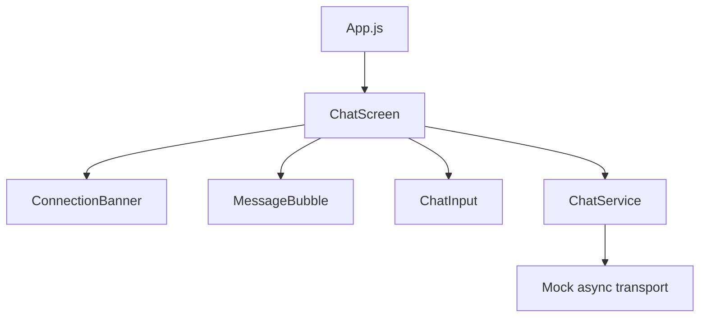
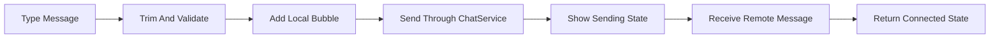

# Architecture

## Application Flow



## Runtime Layers

| Layer | Files | Responsibility |
| --- | --- | --- |
| Shell | `App.js` | Safe-area layout and app entry |
| Screen | `src/screens/ChatScreen.js` | Message state, send workflow, connection state |
| Components | `src/components/*.js` | Chat input, connection banner, message bubbles |
| Service | `src/services/ChatService.js` | Message creation and transport abstraction |
| Styles | `src/styles/appStyles.js` | Shared React Native styles |
| Legacy | `legacy/java` | Original Java socket client/server reference |

## Workflow



## Backend Upgrade Path

Replace `ChatService.send()` with a WebSocket or HTTP implementation. Keep `ChatScreen` and presentational components stable by returning the same message shape:

```text
id, author, body, direction, timestamp
```
