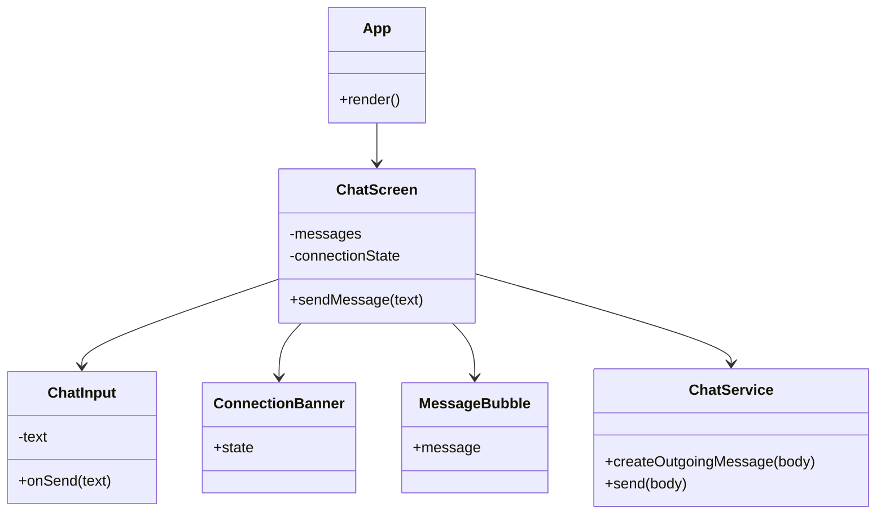

# Class And Module Dependencies

The React Native version uses functional modules rather than Java classes.

## Legacy Mapping

| Legacy Java Class | React Native Replacement |
| --- | --- |
| `rchatc` | `ChatScreen`, `ChatInput`, `MessageBubble` |
| `rchatserver` | Future backend service or WebSocket server |
| Socket reader thread | `ChatService` transport abstraction |
