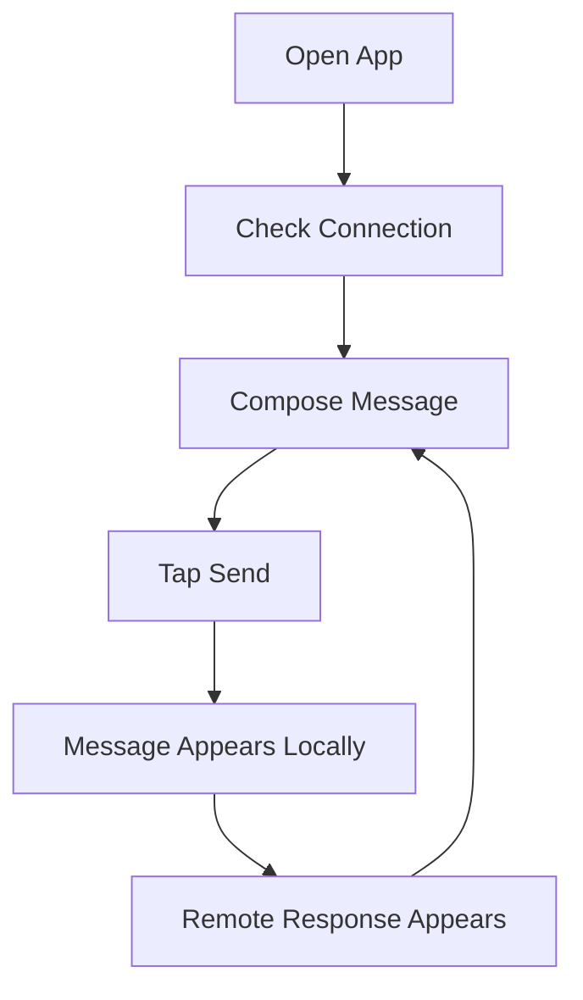

# User Guide

## Send A Message

1. Open the app.
2. Confirm the connection banner says `Connected`.
3. Type a message.
4. Press `Send`.
5. Review the local message and simulated remote response.

## User Workflow

## Troubleshooting

| Issue | Action |
| --- | --- |
| App does not start | Run `npm install`, then `npm run start`. |
| Expo cannot find device | Use Expo Go QR code or start an emulator first. |
| Messages do not return | Check `src/services/ChatService.js`; the mock service may have been replaced. |
